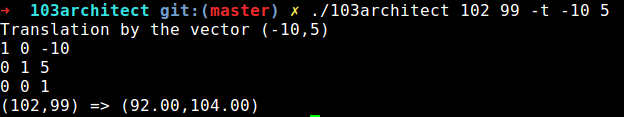

# 103architect
Epitech first year project : [CPE] 103architect

3rd mathematic module project of the first year

Deadline : 2 weeks

Beginning of the project : 30/11/2015, 07h42

Group size : 2 person

Contributor : monge_p

# 103architect

The goal of this project is to develop an application to compute points images in the plan after several transfor-
mations.

To make it nice and clean, you chose to use homogeneous coordinates. How clever of you.

O being the origin of both axis, here are the transformations to be implemented :

1. any translation,

2. homtheties centered at 0,

3. rotations centered at 0,

4. symmetries about any axis that passes through 0,

5. many combination of the previous transformations

## Getting started

These instructions will allow you to obtain a copy of the operational project on your local machine for development and testing purposes.

### Prerequisites

What do you need to install the software and how to install it?

```
python
```

### Installation

Here's how to start the project on your computer

Clone and go in the directory 103architect

Running project

```
./103architect x y transfo1 arg11 [arg12] [transfor2 arg12 [arg22]] ...
```

x   abscissa of the original point

y   ordinate of the original point

transfo arg1 [arg2]

-t  i j : translation along the coordinate vector (i,j)

-h  m n : homothety with center 0 and scale factors m along x-axis and n along y-axis,

-r  α : rotation centered in O at angle α degrees,

-s  α : symmetry about the axis passing by 0 and inclined with an α

-degree angle


## Screenshot



## Build with

* [Python](https://en.wikipedia.org/wiki/Python_(programming_language))

## Auteurs

* **David Munoz** - [DavidMunoz-dev](https://github.com/davidmunoz-dev)
